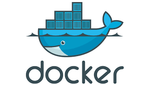

<p align="center" id="top">
    
</p>

<h1 align="center">DOCKER</h1>

## Configurações iniciais do Docker

### Docker Help

```bash
docker --help
# New sintaxe
docker container --help
```

### Executar Imagem

```bash
docker run -d -p 80:80 --name [containerName] docker/getting-started
```

- <code>-d</code> executar o contêiner no modo desanexado (em segundo plano)

- <code>-p 80:80</code>  mapear a porta 80 do host para a porta 80 no contêiner

- <code>--name</code> renomear contêiner a ser usada

- <code>-docker/getting-started</code> a imagem a ser usada

### Executar um comando em um novo contêiner com <code>bash</code> interativo

```bash
docker run -it [containerId||containerName]
```

### Executar um comando dentro do contêiner em execução com <code>bash</code> interativo

```bash
docker exec -it [containerId||containerName] /bin/bash
```

```bash
docker exec -it [containerId||containerName] bash
```

### Executa comandos dentro do contêiner diretamente

```bash
docker exec [containerId||containerName] [command]
```

### Baixar imagem do Hub Docker

```bash
docker pull [imageName]
```

### Baixar imagem especifica do Hub Docker (TAG)

```bash
docker pull debian:10
```

```bash
docker pull debian:buster
```

### Listar Imagens

```bash
docker images
```

### Excluir Imagens

```bash
docker rmi [containerId||containerName]
```

### Listar contêiner em execução

```bash
docker ps
# OR
docker container ls
```

- <code>-a</code> lista todos contêiner executados anteriormente

### Parar contêiner em execução

```bash
docker stop [containerId||containerName]
```

### Iniciar contêiner

```bash
docker start [containerId||containerName]
```

### Excluir contêiner

```bash
docker rm [containerId||containerName]
```

### Informações, logs e processos dos contêiner

#### Informação do servidor Docker

```bash
docker info
```

#### Logs do contêiner

```bash
docker logs [containerId||containerName]
```

#### Verificar processos em execução no contêiner

```bash
docker top [containerId||containerName]
```

### Excluir todos os contêineres parados

```bash
docker container prune
```

### Copiando arquivos da maquina local para contêiner

```bash
docker cp [diretório/origem/meuArquivoLocal.txt] [containerId||containerName]:[/diretório/destino]
```

### Copiando arquivos do contêiner para maquina local

```bash
docker cp [containerId||containerName]:[/diretório/origem] [diretório/destino/meuArquivoLocal.txt]
```

### Retornar informações de baixo nível sobre objetos do Docker

```bash
docker inspect [containerId||containerName]
```

## Criando um contêiner de Mysql

```bash
docker run -d -e MYSQL_ROOT_PASSWORD=Senha123 -p 3306:3306 --name mysql-A mysql
```

- <code>-d</code> executar o contêiner no modo desanexado (em segundo plano)

- <code>-p 3306:3306</code>  mapear a porta 80 do host para a porta 80 no contêiner

- <code>-e</code> definir variáveis de ambiente

### Acessar servidor Mysql

```bash
mysql -u root -p --protocol=tcp --port=3606
```

### Criar tabela no Mysql

```bash
CREATE DATABASE teste;
```

### Listar tabelas no Mysql

```bash
SHOW DATABASES;
```
## Volume

### Montando (Mount) um local de armazenamento na maquina local

OBS: Consultar dentro do contêiner o local onde está sendo salvo o banco de dados com o comando <code>docker inspect [containerId||containerName]</code> no índice <code>Mounts</code>: <code>Destination</code>

```bash
docker run -d -e MYSQL_ROOT_PASSWORD=Senha123 -p 3306:3306 --name [containerName] mysql --volume=[diretorioLocal]:[diretorioConteiner||/var/lib/mysql]
```

### No Windows utilizar aspas duplas ao passar <code>[diretorioLocal]</code> exemplo com um contêiner Apache2

```bash
docker run -d --name apache-C httpd -p 80:80 --volume="C:\data\apache":/usr/local/apache2/htdocs
```

### Excluir volume

```bash
docker volume rm [volumeId||volumeName]
```

### Excluir todos os volume que não estão em uso

```bash
docker volume prune
```

## Criando um contêiner com PHP-Apache

```bash
docker pull php:7.4-apache
```

### Download da Imagem

```bash
docker pull php:7.4-apache
```

### Executar contêiner

```bash
docker run -d -p 80:80 --name my-apache-php-app -v "$PWD":/var/www/html php:7.2-apache

docker run -d --name php-AB php:7.4-apache -p 8080:80 --volume="C:\laragon\www\cli-docker\data\php-A":/var/www/html
```

## Limitando memória e CPU e atualizando contêiner

```bash
docker stats [containerId||containerName]
```

```bash
docker update [containerId||containerName] -m 128M --cpus 0.2
```

### Teste de Stress no contêiner

#### Instale Stress no sistema operacinal (Exemplo: Ubuntu)

```bash
apt -y install stress 
```

```bash
stress --cpu 1 --vm-bytes 50m --vm 1 --vm-bytes-50m
```

<h1 align="center">LARADOCK</h1>

### Subir contêiner

```bash
docker-compose up -d [nameImage1] [nameImage2] [nameImage3]
docker-compose up -d nginx mysql phpmyadmin redis
```

### Acessar contêiner

```bash
docker exec -it [containerId||containerName] /bin/sh
# OR
docker exec -it [containerId||containerName] /bin/bash
```

### Executar comandos com Bash interativo

```bash
docker-compose exec --user=laradock [containerId||containerName] bash
```

### Listar contêiner em execução

```bash
docker-composer ps
```

## Referências

- Pesquisa

  - [Docker com VS Code](https://docs.microsoft.com/pt-br/visualstudio/docker/tutorials/docker-tutorial?WT.mc_id=vscode_docker_aka_getstartedwithdocker) neste tutorial, você aprenderá a criar e implantar aplicativos do docker em Windows ou Mac usando Visual Studio Code.

  - [Laravel + Docker = Laradock](https://youtu.be/GienvDWdBmo) Crie um ambiente com Laravel e Docker de maneira rápida, simples e fácil.

### Wakatime

Tempo gasto no IDE para este repositório, rastreado automaticamente com [wakatime](https://wakatime.com/) .

[](https://wakatime.com/badge/github/JuniorLima22/cli-docker)

### Autor

> Made with 💙 by JUNIOR LIMA 👋 <a href="https://www.linkedin.com/in/JuniorLima22/" target="_blank">See my LinkedIn</a> • GitHub <a href="https://github.com/JuniorLima22" target="_blank">@JuniorLima22</a>

<p align="center">
<sub><a href="#top" align="center">↑ voltar para o topo ↑</a></sub>
</p>